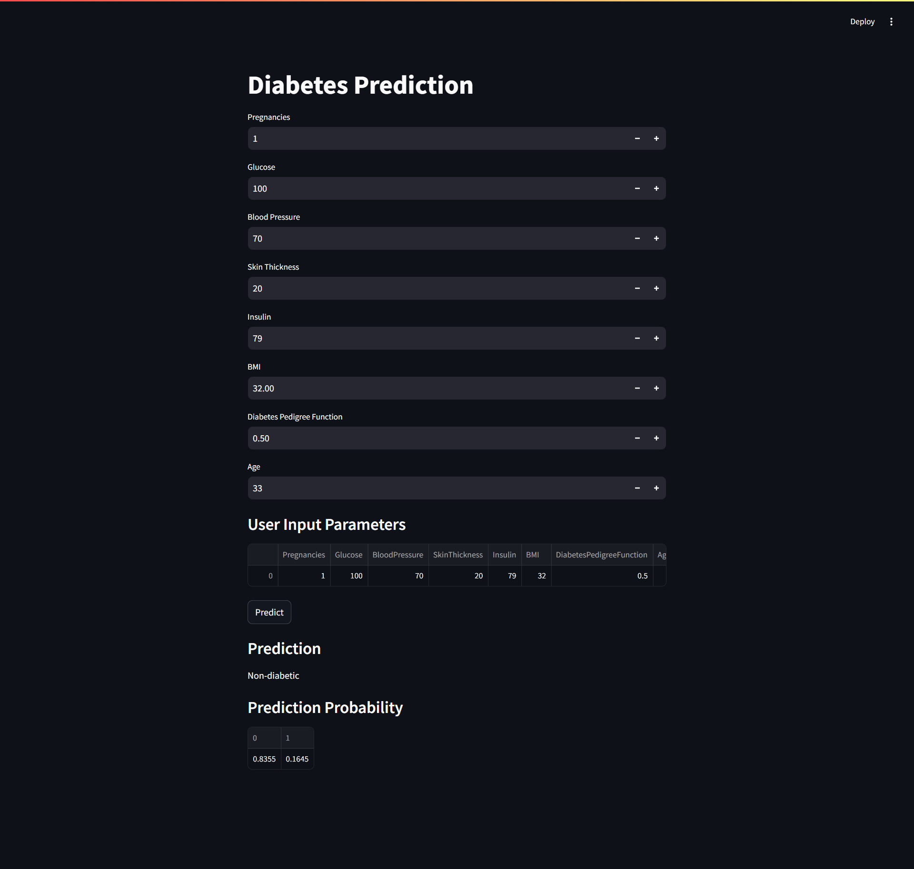
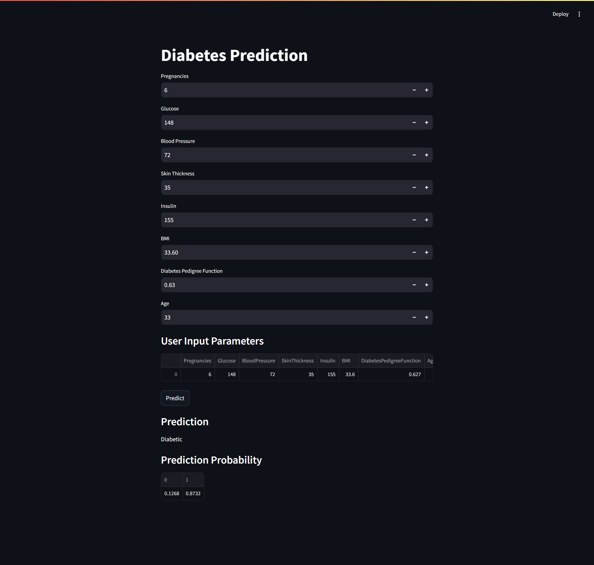

# Diabetes Prediction
This repository contains a Streamlit application for predicting diabetes based on user input parameters. The prediction is made using a pre-trained machine learning model.

## Contents
- `app.py`: The main Streamlit application script.
- `diabetes_model.pkl`: The trained machine learning model used for prediction.
- `scaler.pkl`: The scaler used to normalize the input features.
- `Diabetes_Prediction-Ika_Nurfitriani.ipynb`: A Jupyter Notebook used for model training and evaluation.

## Installation
To run this application, you'll need to have Python installed along with the necessary libraries. Ensure you have the following libraries installed:

- streamlit
- pandas
- numpy
- scikit-learn
- pickle

You can install these libraries using the following command:
```
pip install streamlit pandas numpy scikit-learn pickle
```

Ensure that you have the following files in your working directory:
- `app.py`
- `diabetes_model.pkl`
- `scaler.pkl`
- `Diabetes_Prediction-Ika_Nurfitriani.ipynb`

## Running the Application
To start the Streamlit application, use the following command:
```
streamlit run app.py
```
This will launch the application locally. Open the provided URL in your web browser to interact with the diabetes prediction model.

## Usage
1. User Input: Enter the required parameters for the prediction.
- Pregnancies
- Glucose
- Blood Pressure
- Skin Thickness
- Insulin
- BMI
- Diabetes Pedigree Function
- Age
2. Prediction: Click the `Predict` button to get the prediction.
- The application will display whether the person is diabetic or non-diabetic.
- If available, the prediction probabilities will also be displayed.

## Screen Capture
The following is a screen capture from the Diabetes Prediction App:
- `SS1`
 

- `SS2`


## Author
[@Ika Nurfitriani](https://github.com/ikanurfitriani)